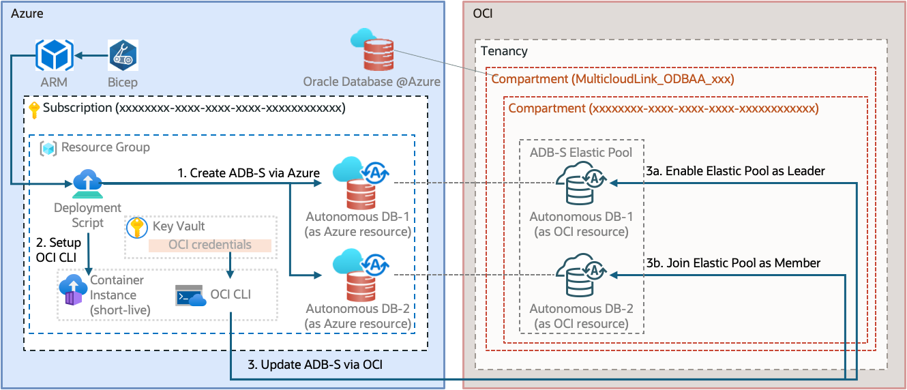

# Demo: Provisioning ADB-S with Elastic Pool via Bicep & OCI CLI

This example demonstrates how to configure Autonomous Database on Azure (ADB-S) with an elastic pool by integrating Bicep and OCI CLI.


## Prerequisites

1. **Azure Subscription**: Onboarded to Oracle Database@Azure and able to provision ADB-S.
2. **Resource Group**: An Azure Resource Group for all POC resources.
3. **Key Vault**: An Azure Key Vault for storing secrets.
4. **Azure CLI**: Installed and configured.
5. **OCI CLI Environment Variables**: See [OCI CLI Environment Variables](https://docs.oracle.com/en-us/iaas/Content/API/SDKDocs/clienvironmentvariables.htm).

Refer to [`setup.sh`](setup.sh) for setup instructions.

## Bicep Modules

- [`adbs-az.bicep`](adbs-az.bicep): Creates ADB-S as a standard Azure resource.
- [`adbs-oci.bicep`](adbs-oci.bicep): Modifies ADB-S via OCI CLI using an Azure Deployment Script:
    - Installs OCI CLI
    - Authenticates OCI CLI with API key from Azure Key Vault
    - Modifies ADB-S using OCI CLI
- [`adbs-main.bicep`](adbs-main.bicep): Deploys two ADB-S instances (leader & member) in an elastic pool:
    - Provisions two ADB-S instances using `adbs-az.bicep`
    - Promotes the first ADB-S as elastic pool leader using `adbs-oci.bicep`
    - Joins the second ADB-S as elastic pool member using `adbs-oci.bicep`

## Provision Steps
1. Update the [adbs-main.bicepparam](adbs-main.bicepparam)
2. Create Deployment Stack at Resource Group level.
    ```
    az stack group create \
    --name 'demo-adbs-ep' \
    --resource-group 'rg-demo-adbs-ep' \
    --template-file 'adbs-main.bicep' \
    --action-on-unmanage 'deleteAll' --deny-settings-mode none \
    --parameters adbs-main.bicepparam
    ```
## Clean up
1. Clear the ADB-S Elastic Pool (via OCI)
    1. Member ADBS: Leave the elastic pool
    2. Leader ADBS: Terminate the elastic pool
2. Delete the Deployment Stack
    ```
    az stack group delete \
    --name 'demo-adbs-ep' \
    --resource-group 'rg-demo-adbs-ep' \
    --action-on-unmanage deleteResources
    ```